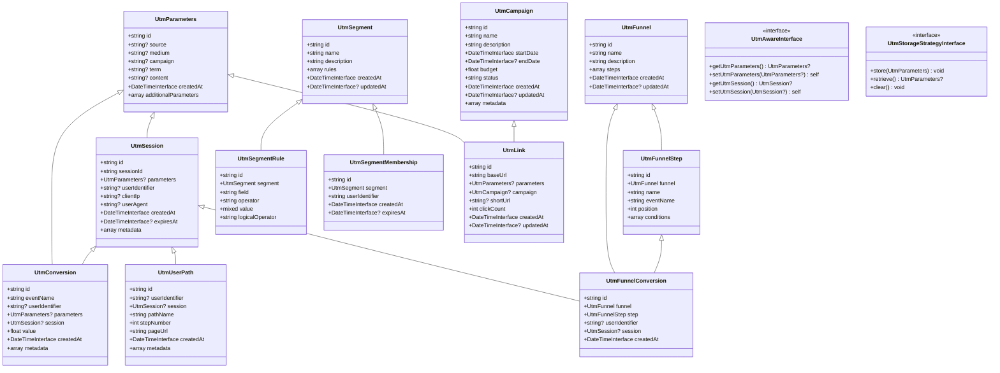

# Symfony UTM Bundle 实体设计

## 实体设计概述

基于通用性优先和可扩展性原则，我们设计了以下核心实体，以支持UTM参数捕获、活动效果分析和用户路径跟踪等功能。所有实体设计考虑了与不同类型Symfony项目的兼容性，并提供了扩展点以满足自定义需求。

## 核心实体

### UtmParameters

```php
/**
 * 存储标准UTM参数
 */
class UtmParameters
{
    protected string $id;
    protected ?string $source = null;     // utm_source: 流量来源（如：google, facebook, newsletter）
    protected ?string $medium = null;     // utm_medium: 营销媒介（如：cpc, email, social）
    protected ?string $campaign = null;   // utm_campaign: 营销活动名称
    protected ?string $term = null;       // utm_term: 付费关键词
    protected ?string $content = null;    // utm_content: 区分相似内容/广告
    protected \DateTimeInterface $createdAt;
    protected array $additionalParameters = []; // 存储非标准UTM参数
}
```

### UtmSession

```php
/**
 * 表示一个用户会话，包含UTM参数和会话信息
 */
class UtmSession
{
    protected string $id;
    protected string $sessionId;          // 用户会话ID
    protected ?UtmParameters $parameters = null;  // UTM参数引用
    protected ?string $userIdentifier = null;     // 用户标识符（可为空，未登录用户）
    protected ?string $clientIp = null;           // 客户端IP地址
    protected ?string $userAgent = null;          // 用户代理字符串
    protected \DateTimeInterface $createdAt;      // 会话创建时间
    protected ?\DateTimeInterface $expiresAt = null;  // 会话过期时间
    protected array $metadata = [];               // 额外会话元数据
}
```

### UtmConversion

```php
/**
 * 表示一个转化事件，关联UTM参数
 */
class UtmConversion
{
    protected string $id;
    protected string $eventName;          // 转化事件名称
    protected ?string $userIdentifier = null; // 用户标识符
    protected ?UtmParameters $parameters = null; // 关联的UTM参数
    protected ?UtmSession $session = null;    // 关联的UTM会话
    protected float $value = 0.0;         // 转化价值
    protected \DateTimeInterface $createdAt;  // 转化时间
    protected array $metadata = [];       // 转化元数据
}
```

### UtmUserPath

```php
/**
 * 表示用户在网站上的路径
 */
class UtmUserPath
{
    protected string $id;
    protected ?string $userIdentifier = null;     // 用户标识符
    protected ?UtmSession $session = null;        // 关联的UTM会话
    protected string $pathName;                   // 路径名称/标识符
    protected int $stepNumber;                    // 步骤序号
    protected string $pageUrl;                    // 页面URL
    protected \DateTimeInterface $createdAt;      // 记录时间
    protected array $metadata = [];               // 路径元数据
}
```

### UtmFunnel

```php
/**
 * 定义漏斗模型
 */
class UtmFunnel
{
    protected string $id;
    protected string $name;               // 漏斗名称
    protected string $description;        // 漏斗描述
    protected array $steps = [];          // 漏斗步骤
    protected \DateTimeInterface $createdAt;
    protected ?\DateTimeInterface $updatedAt = null;
}
```

### UtmFunnelStep

```php
/**
 * 定义漏斗步骤
 */
class UtmFunnelStep
{
    protected string $id;
    protected UtmFunnel $funnel;          // 关联的漏斗
    protected string $name;               // 步骤名称
    protected string $eventName;          // 触发事件名称
    protected int $position;              // 步骤位置
    protected array $conditions = [];     // 步骤条件
}
```

### UtmFunnelConversion

```php
/**
 * 记录用户在漏斗中的转化
 */
class UtmFunnelConversion
{
    protected string $id;
    protected UtmFunnel $funnel;                  // 关联的漏斗
    protected UtmFunnelStep $step;                // 关联的漏斗步骤
    protected ?string $userIdentifier = null;     // 用户标识符
    protected ?UtmSession $session = null;        // 关联的UTM会话
    protected \DateTimeInterface $createdAt;      // 转化时间
}
```

### UtmSegment

```php
/**
 * 定义用户分群
 */
class UtmSegment
{
    protected string $id;
    protected string $name;               // 分群名称
    protected string $description;        // 分群描述
    protected array $rules = [];          // 分群规则
    protected \DateTimeInterface $createdAt;
    protected ?\DateTimeInterface $updatedAt = null;
}
```

### UtmSegmentRule

```php
/**
 * 定义分群规则
 */
class UtmSegmentRule
{
    protected string $id;
    protected UtmSegment $segment;        // 关联的分群
    protected string $field;              // 规则字段
    protected string $operator;           // 操作符
    protected mixed $value;               // 规则值
    protected string $logicalOperator;    // 逻辑操作符（AND/OR）
}
```

### UtmSegmentMembership

```php
/**
 * 记录用户与分群的关系
 */
class UtmSegmentMembership
{
    protected string $id;
    protected UtmSegment $segment;              // 关联的分群
    protected string $userIdentifier;           // 用户标识符
    protected \DateTimeInterface $createdAt;    // 添加时间
    protected ?\DateTimeInterface $expiresAt = null; // 过期时间
}
```

### UtmCampaign

```php
/**
 * 营销活动定义
 */
class UtmCampaign
{
    protected string $id;
    protected string $name;                     // 活动名称
    protected string $description;              // 活动描述
    protected \DateTimeInterface $startDate;    // 开始日期
    protected ?\DateTimeInterface $endDate = null; // 结束日期
    protected float $budget = 0.0;              // 活动预算
    protected string $status;                   // 活动状态
    protected \DateTimeInterface $createdAt;
    protected ?\DateTimeInterface $updatedAt = null;
    protected array $metadata = [];             // 活动元数据
}
```

### UtmLink

```php
/**
 * UTM链接生成
 */
class UtmLink
{
    protected string $id;
    protected string $baseUrl;                  // 基础URL
    protected ?UtmParameters $parameters = null; // UTM参数
    protected ?UtmCampaign $campaign = null;    // 关联的营销活动
    protected ?string $shortUrl = null;         // 短链接URL
    protected int $clickCount = 0;              // 点击次数
    protected \DateTimeInterface $createdAt;
    protected ?\DateTimeInterface $updatedAt = null;
}
```

## 接口设计

### UtmAwareInterface

```php
/**
 * 实现此接口的实体将能够关联UTM参数
 */
interface UtmAwareInterface
{
    public function getUtmParameters(): ?UtmParameters;
    public function setUtmParameters(?UtmParameters $parameters): self;
    public function getUtmSession(): ?UtmSession;
    public function setUtmSession(?UtmSession $session): self;
}
```

### UtmStorageStrategyInterface

```php
/**
 * UTM存储策略接口
 */
interface UtmStorageStrategyInterface
{
    public function store(UtmParameters $parameters): void;
    public function retrieve(): ?UtmParameters;
    public function clear(): void;
}
```

## 实体关系图



## 实体设计考虑因素

### 通用性

- 所有实体都设计为可扩展，包含足够的元数据字段支持自定义属性
- UtmAwareInterface 允许任何实体轻松集成 UTM 跟踪功能
- 通过接口和抽象类提供扩展点

### 灵活性

- 支持标准 UTM 参数 (source, medium, campaign, term, content) 与自定义参数
- 实体间关系设计允许多样化的数据分析和报表生成
- 支持多种存储策略

### 性能

- 合理设计关联关系，避免过度关联导致性能问题
- 实体设计考虑了查询优化

### 兼容性

- 设计兼容多种 ORM (Doctrine, Propel 等)
- 不依赖特定的用户实体实现，通过标识符关联
- 支持各种 Symfony 版本

### 可扩展性

- 所有关键实体提供元数据字段，允许存储额外信息
- 接口设计支持自定义实现替换默认功能
- 实体间关系设计允许未来功能扩展
