# Symfony UTM Bundle 工作流程

本文档描述了Symfony UTM Bundle中各个核心功能的工作流程，包括UTM参数捕获、会话管理、转化跟踪和用户路径分析等。

## 1. UTM参数捕获工作流

当用户通过带有UTM参数的链接访问应用程序时，此工作流负责捕获、验证和存储这些参数。


### 关键组件

1. **UTM请求监听器**: 
   - 实现: `Symfony\Component\HttpKernel\EventListener\RequestListener`
   - 职责: 监听所有HTTP请求，检测UTM参数

2. **UTM参数提取服务**:
   - 职责: 从HTTP请求中提取标准和自定义UTM参数

3. **UTM参数验证服务**:
   - 职责: 验证UTM参数，过滤无效值，标准化数据

4. **UTM会话管理器**:
   - 职责: 管理UTM会话生命周期，处理会话合并和过期

5. **存储策略**:
   - 接口: `UtmStorageStrategyInterface`
   - 具体实现:
     - `SessionStorageStrategy`: 存储在用户会话中
     - `CookieStorageStrategy`: 存储在Cookie中
     - `DatabaseStorageStrategy`: 持久化到数据库

### 实体变化

- **UtmParameters**: 创建新实体记录UTM参数值
- **UtmSession**: 创建或更新会话实体，关联UTM参数

## 2. UTM会话关联与用户识别工作流

此工作流描述了如何将UTM会话与已登录的用户关联起来，以及处理跨设备识别。


### 关键组件

1. **安全监听器**:
   - 实现: `Symfony\Component\Security\Http\Firewall\AuthenticationListener`
   - 职责: 监听用户登录事件

2. **UTM会话管理器**:
   - 职责: 管理UTM会话与用户的关联

3. **用户提供者**:
   - 职责: 提供用户信息和标识符

### 实体变化

- **UtmSession**: 更新userIdentifier字段，建立与用户的关联

## 3. 转化事件跟踪工作流

当用户完成重要操作（如注册、购买等）时，此工作流负责跟踪这些转化事件并关联UTM数据。


### 关键组件

1. **转化事件监听器**:
   - 职责: 监听应用程序中的转化事件

2. **UTM上下文管理器**:
   - 职责: 提供当前请求的UTM上下文信息

3. **转化服务**:
   - 职责: 创建和存储转化记录
   - 方法: `trackConversion(string $eventName, ?float $value = null, array $metadata = [])`

### 实体变化

- **UtmConversion**: 创建新实体，关联UTM参数和会话

## 4. 用户路径跟踪工作流

此工作流跟踪用户在网站上的导航路径，记录页面访问和行为序列。


### 关键组件

1. **路径跟踪服务**:
   - 职责: 跟踪和记录用户导航路径
   - 方法: `trackPageView(string $pageUrl, array $metadata = [])`

2. **UTM上下文管理器**:
   - 职责: 提供当前请求的UTM上下文信息

### 实体变化

- **UtmUserPath**: 创建新实体，记录页面访问和步骤序号

## 5. 漏斗分析工作流

此工作流创建和分析转化漏斗，跟踪用户通过预定义步骤的进度。


### 关键组件

1. **漏斗管理服务**:
   - 职责: 创建和管理漏斗定义
   - 方法: `createFunnel(string $name, string $description, array $steps)`

2. **漏斗分析服务**:
   - 职责: 分析用户在漏斗中的进度
   - 方法: `analyzeFunnel(string $funnelId, ?string $startDate = null, ?string $endDate = null)`

### 实体变化

- **UtmFunnel**: 创建漏斗定义
- **UtmFunnelStep**: 创建漏斗步骤
- **UtmFunnelConversion**: 记录用户完成漏斗步骤的事件

## 6. 用户分群工作流

此工作流创建用户分群并基于UTM数据和用户行为对用户进行分组。


### 关键组件

1. **分群管理服务**:
   - 职责: 创建和管理用户分群
   - 方法: `createSegment(string $name, string $description, array $rules)`

2. **分群处理服务**:
   - 职责: 计算分群成员资格
   - 方法: `processSegment(string $segmentId)`

3. **分群计算引擎**:
   - 职责: 基于规则评估用户资格

### 实体变化

- **UtmSegment**: 创建分群定义
- **UtmSegmentRule**: 创建分群规则
- **UtmSegmentMembership**: 记录用户的分群成员资格

## 7. UTM链接生成工作流

此工作流创建并管理带有UTM参数的链接，支持短链接生成和点击跟踪。


### 关键组件

1. **链接构建器**:
   - 职责: 创建带有UTM参数的链接
   - 方法: `buildLink(string $baseUrl, array $utmParams, ?string $campaignId = null)`

2. **短链接服务**:
   - 职责: 生成和管理短链接
   - 方法: `shorten(string $url): string`

### 实体变化

- **UtmParameters**: 创建UTM参数记录
- **UtmLink**: 创建链接记录，关联UTM参数和活动

## 8. 归因分析工作流

此工作流分析转化事件与UTM数据的关系，执行归因分析。


### 关键组件

1. **归因分析服务**:
   - 职责: 执行不同类型的归因分析
   - 方法: `analyze(string $conversionType, string $attributionModel, ?string $startDate = null, ?string $endDate = null)`

2. **归因模型引擎**:
   - 职责: 实现不同的归因算法
   - 支持模型: 首次接触、最后接触、线性、位置、时间衰减等

## 9. 整体数据流

下图展示了UTM数据在系统中的整体流动过程，从捕获到分析的完整链路。


## 10. 服务依赖关系

以下图表展示了UTM Bundle中各个服务之间的依赖关系。

```mermaid
classDiagram
    UtmParametersExtractor <-- UtmRequestListener
    UtmParametersValidator <-- UtmRequestListener
    UtmSessionManager <-- UtmRequestListener
    UtmStorageStrategyInterface <-- UtmSessionManager
    UtmContextManager <-- UtmSessionManager
    UtmContextManager <-- UtmConversionTracker
    UtmContextManager <-- UtmPathTracker
    UtmSessionManager <-- UtmSecurityListener
    UtmConversionTracker <-- ConversionEventListener
    UtmFunnelManager <-- UtmFunnelAnalyzer
    UtmSegmentManager <-- UtmSegmentProcessor
    UtmLinkBuilder <-- UtmCampaignManager
    UtmAttributionAnalyzer <-- UtmReportGenerator
    UtmPathAnalyzer <-- UtmReportGenerator
    UtmFunnelAnalyzer <-- UtmReportGenerator
    UtmSegmentAnalyzer <-- UtmReportGenerator
    
    class UtmParametersExtractor {
        +extract(Request): array
    }
    class UtmParametersValidator {
        +validate(array): array
    }
    class UtmSessionManager {
        +createSession(UtmParameters): UtmSession
        +getSession(): ?UtmSession
        +associateUser(string): void
    }
    class UtmStorageStrategyInterface {
        <<interface>>
        +store(UtmParameters): void
        +retrieve(): ?UtmParameters
        +clear(): void
    }
    class UtmContextManager {
        +getCurrentParameters(): ?UtmParameters
        +getCurrentSession(): ?UtmSession
    }
    class UtmConversionTracker {
        +trackConversion(string, float, array): UtmConversion
    }
    class UtmPathTracker {
        +trackPageView(string, array): UtmUserPath
    }
    class UtmFunnelManager {
        +createFunnel(string, string, array): UtmFunnel
        +addStep(UtmFunnel, string, string, int): UtmFunnelStep
    }
    class UtmFunnelAnalyzer {
        +analyzeFunnel(string, ?string, ?string): array
    }
    class UtmSegmentManager {
        +createSegment(string, string, array): UtmSegment
        +addRule(UtmSegment, string, string, mixed): UtmSegmentRule
    }
    class UtmSegmentProcessor {
        +processSegment(string): void
    }
    class UtmLinkBuilder {
        +buildLink(string, array, ?string): UtmLink
    }
    class UtmCampaignManager {
        +createCampaign(string, string, string): UtmCampaign
    }
    class UtmAttributionAnalyzer {
        +analyze(string, string, ?string, ?string): array
    }
    class UtmReportGenerator {
        +generateChannelReport(?string, ?string): array
        +generateAttributionReport(string, ?string, ?string): array
        +generatePathReport(?string, ?string): array
        +generateFunnelReport(string, ?string, ?string): array
        +generateSegmentReport(string): array
    }
    class UtmRequestListener {
        +onKernelRequest(RequestEvent): void
    }
    class UtmSecurityListener {
        +onLoginSuccess(LoginSuccessEvent): void
    }
    class ConversionEventListener {
        +onConversionEvent(ConversionEvent): void
    }
```



## 配置示例

```yaml
symfony_utm:
    # 存储配置
    storage:
        strategy: database  # 可选: session, cookie, database
        session_key: utm_parameters
        cookie_lifetime: 2592000  # 30天，单位：秒
    
    # 参数配置
    parameters:
        # 允许捕获的标准UTM参数
        allowed_parameters:
            - utm_source
            - utm_medium
            - utm_campaign
            - utm_term
            - utm_content
        # 允许捕获的自定义UTM参数（可选）
        custom_parameters:
            - utm_affiliate
            - utm_partner
        # 验证规则
        validation:
            max_length: 255
            sanitize: true
    
    # 会话配置
    session:
        lifetime: 2592000  # 30天，单位：秒
        renew_on_visit: true
    
    # 路径跟踪配置
    path_tracking:
        enabled: true
        exclude_paths:
            - /admin/*
            - /api/*
            - /_profiler/*
        max_paths_per_session: 100
    
    # 漏斗配置
    funnel:
        max_steps: 10
        conversion_window: 2592000  # 30天，单位：秒
    
    # 分群配置
    segment:
        processing_interval: 86400  # 1天，单位：秒
        membership_lifetime: 2592000  # 30天，单位：秒
    
    # 链接生成配置
    link_builder:
        enable_shortener: true
        shortener_service: 'app.link_shortener'  # 服务ID（可选）
    
    # 报表配置
    reporting:
        default_attribution_model: last_touch  # 可选: first_touch, last_touch, linear, position, time_decay
        date_format: 'Y-m-d'
``` 